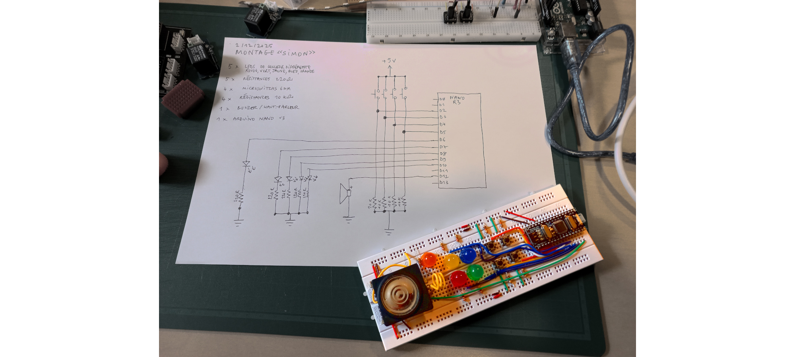

# Arduino jeu

Quelques exemples de code pour réaliser des petits jeux électroniques.

Voir aussi :
  * https://github.com/emoc/arduino_utile
  * https://github.com/emoc/arduino_interaction

## Simon

Code et circuit pour reproduire le fonctionnement du jeu de mémorisation «Simon»
