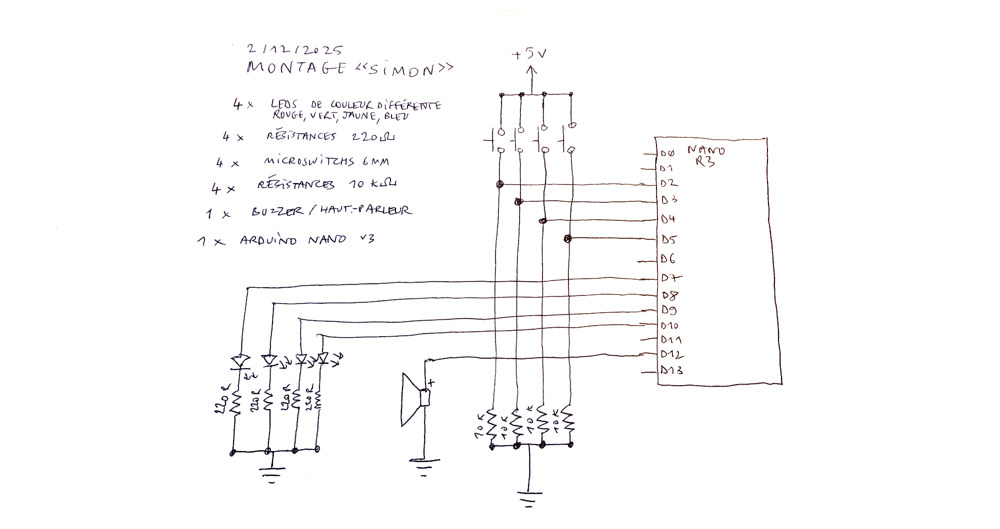
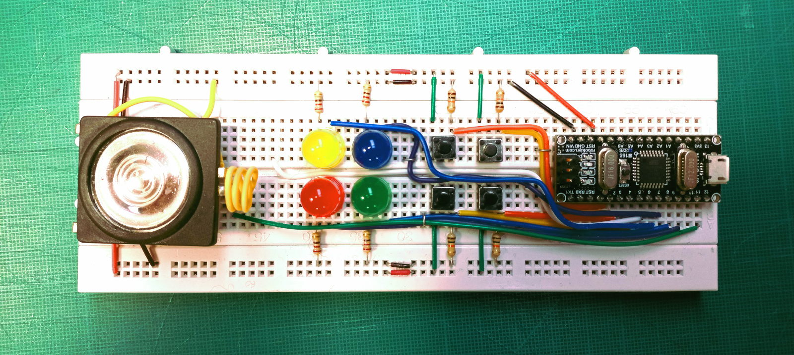

# Simon

Code et circuit pour reproduire le fonctionnement du jeu de mémorisation «Simon» sur arduino nano

**simon_simple**

Le jeu définit au hasard une séquence, la joue et attend qu'elle soir rejouée dans un temps donné

**simon_complet**

Le jeu définit une séquence au hasard qu'il faudra rejouer un élément à la fois : c'est à dire 
- jouer une couleur 
- attendre l'interaction
- jouer deux couleurs
- attendre l'interaction
- etc. jusqu'à ce que la taille maximum définie soit atteinte, dans ce cas c'est gagné
Le rythme s'accélère progressivement.
C'est le principe utilisé par le «Simon» original 

## Ressources sur le «Simon»

  * https://fr.wikipedia.org/wiki/Simon_(jeu)
  * Reverse engineering du Simon original : https://www.waitingforfriday.com/?p=586 ([archive](https://web.archive.org/web/20250114130520/https://www.waitingforfriday.com/?p=586))